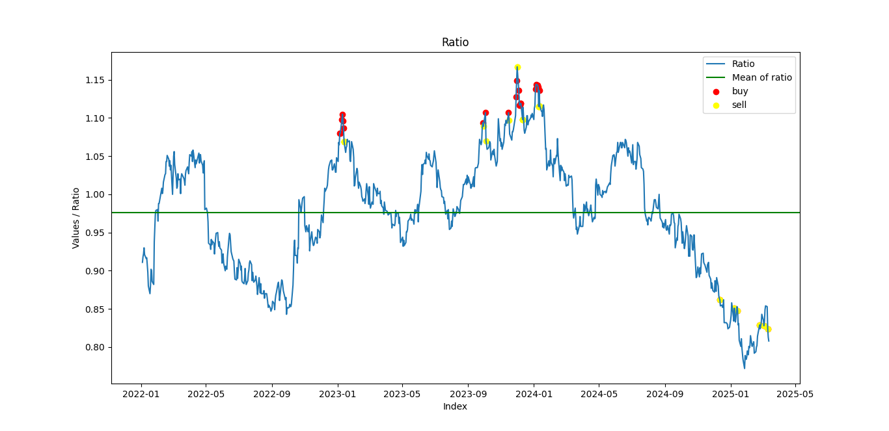

# Pairs Trading Strategy for NSE Stocks

A Python implementation of the pairs trading strategy inspired by Mark Whistler, featuring backtesting capabilities and automated daily triggers for identifying profitable trading opportunities.

## 🚀 Features

- ✅ Supports all **NSE stocks**
- ✅ **Automated stock data fetching** (no manual uploads required)
- ✅ **Backtesting system** to evaluate strategy performance
- ✅ **Daily tracking** of trade signals
- ✅ **Database management** to prevent redundant downloads
- ✅ **Customizable parameters** for backtesting

## 🛠️ Installation

### **Prerequisites**

1. Ensure you have **Python** installed. Install required dependencies using:

```bash
pip install -r requirements.txt
```

2. Set up **MongoDB** Connection

Update the `CONNECTION_STRING` variable in `database.py` with your MongoDB connection string. For example:

```python
CONNECTION_STRING = "mongodb://localhost:27017/"  # Replace with your connection string
```

## 📊 Usage

### **1️⃣ Download Data & Update Database**

1. **Define stock symbols** in `stock_symbol.txt` (one symbol per line, in NSE format).
2. Run the script to fetch or update stock data:
   ```bash
   python database.py
   ```
   - If stock data **does not exist**, it will be downloaded automatically.
   - If stock data **already exists**, it will be updated to the latest date.

### **2️⃣ Run Backtesting**

1. Modify `backtesting.py` to adjust strategy parameters (e.g., entry/exit conditions).
2. Run the backtesting script:
   ```bash
   python backtesting.py
   ```
   - This simulates trades based on historical data and provides performance metrics.


## 📈 Example Output & Trade Visualization


Below is an example of the expected console output:

``` bash
100%|████████████████████████████████████████| 803/803 [02:50<00:00,  4.72it/s]
Total Trades: 27
Number stock Sells:  27
Number stock Target Sells:  25
Number stock Stoploss Sells:  2
```

### 📊 Trade Signal Chart
After running `backtesting.py`, a chart will be generated displaying **buy** and **sell** signals on the stock price movements. This visualization helps traders analyze entry and exit points effectively.

#### Example Chart:


## 📅 Future Enhancements

- 🔹 **Automated trade execution** for live trading
- 🔹 **Enhanced visualization** (performance graphs, trade signals)
- 🔹 **Support for additional stock exchanges**
- 🔹 **Deploy as a Web App for better accessibility and user experience**


---

📩 **Contact**: Have questions? Reach out via [Email](mailto:darshandhanani01@gmail.com)!

